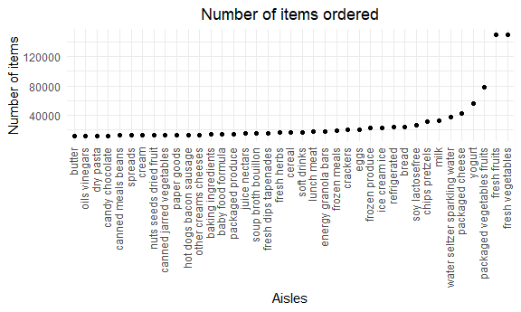

P8105\_hw3\_lc3605
================
Lynn Chen

``` r
library(tidyverse)
```

    ## -- Attaching packages --------------------------------------- tidyverse 1.3.1 --

    ## v ggplot2 3.3.5     v purrr   0.3.4
    ## v tibble  3.1.4     v dplyr   1.0.7
    ## v tidyr   1.1.3     v stringr 1.4.0
    ## v readr   2.0.1     v forcats 0.5.1

    ## -- Conflicts ------------------------------------------ tidyverse_conflicts() --
    ## x dplyr::filter() masks stats::filter()
    ## x dplyr::lag()    masks stats::lag()

``` r
library(dplyr)
library(readxl)
library(ggplot2)
library(p8105.datasets)
library(patchwork)
knitr::opts_chunk$set(
  fig.width = 6,
  fig.asp = .6,
  out.width = "90%"
)
theme_set(theme_minimal() + theme(legend.position = "bottom"))
options(
  ggplot2.continuous.colour = "viridis",
  ggplot2.continuous.fill = "viridis"
)
scale_colour_discrete = scale_color_viridis_d
scale_fill_discrete = scale_fill_viridis_d
```

## Problem 1:

Load `instacart` data

``` r
data("instacart")
```

The **instacart** dataset contains 1384617 rows and 15 columns. The data
contains the following variables: **add\_to\_cart\_order, aisle,
aisle\_id, days\_since\_prior\_order, department, department\_id,
eval\_set, order\_dow, order\_hour\_of\_day, order\_id, order\_number,
product\_id, product\_name, reordered, user\_id**; and each row in the
dataset represents products ordered. In total, there are 39123 products
found in 131209 orders, and 131209 distinct users who made a purchase.

-   How many aisles are there, and which aisles are the most items
    ordered from?

``` r
instacart %>% 
  summarize(n_aisles = n_distinct(aisle_id))
## # A tibble: 1 x 1
##   n_aisles
##      <int>
## 1      134
  
instacart %>% 
  group_by(aisle) %>% 
  summarize(most_order = n()) %>% 
  arrange(desc(most_order)) %>% 
  top_n(3)
## # A tibble: 3 x 2
##   aisle                      most_order
##   <chr>                           <int>
## 1 fresh vegetables               150609
## 2 fresh fruits                   150473
## 3 packaged vegetables fruits      78493
```

There are **134** aisles in total. The top 3 aisles with most items
ordered are **fresh vegetables, fresh fruits, and packaged vegetables
fruits**.

-   Make a plot that shows the number of items ordered in each aisle,
    limiting this to aisles with more than 10000 items ordered. Arrange
    aisles sensibly, and organize your plot so others can read it.

``` r
instacart %>%
  count(aisle) %>% 
  filter(n > 10000) %>% 
  mutate(
    aisle = factor(aisle),
    aisle = fct_reorder(aisle, n)) %>% 
  ggplot(aes(x = aisle, y = n)) + 
    geom_point() +
  theme(axis.text.x = element_text(angle = 90, vjust = 0.3, hjust = 1), 
        plot.title = element_text(hjust = 0.5)) + 
  labs(
    title = "Number of items ordered",
    x = "Aisles",
    y = "Number of items"
  )
```



-   Make a table showing the three most popular items in each of the
    aisles “baking ingredients”, “dog food care”, and “packaged
    vegetables fruits”. Include the number of times each item is ordered
    in your table.

``` r
instacart %>% 
  filter(aisle %in% c("baking ingredients", "dog food care", "packaged vegetables fruits")) %>% 
  group_by(aisle) %>% 
  count(product_name) %>% 
  mutate(rank = min_rank(desc(n))) %>%
  filter(rank <= 3) %>% 
  arrange(aisle, rank) %>%
  select(-rank, most_popular_items = product_name, number_of_items = n) %>% 
  knitr::kable()
```

| aisle                      | most\_popular\_items                          | number\_of\_items |
|:---------------------------|:----------------------------------------------|------------------:|
| baking ingredients         | Light Brown Sugar                             |               499 |
| baking ingredients         | Pure Baking Soda                              |               387 |
| baking ingredients         | Cane Sugar                                    |               336 |
| dog food care              | Snack Sticks Chicken & Rice Recipe Dog Treats |                30 |
| dog food care              | Organix Chicken & Brown Rice Recipe           |                28 |
| dog food care              | Small Dog Biscuits                            |                26 |
| packaged vegetables fruits | Organic Baby Spinach                          |              9784 |
| packaged vegetables fruits | Organic Raspberries                           |              5546 |
| packaged vegetables fruits | Organic Blueberries                           |              4966 |

-   Make a table showing the mean hour of the day at which Pink Lady
    Apples and Coffee Ice Cream are ordered on each day of the week;
    format this table for human readers (i.e. produce a 2 x 7 table).

``` r
instacart %>% 
  filter(product_name %in% c("Pink Lady Apples", "Coffee Ice Cream")) %>% 
  group_by(product_name, order_dow) %>% 
  summarize(mean_hour = mean(order_hour_of_day)) %>% 
  mutate(
    order_dow = recode(order_dow,`0` = "Sun", `1` = "Mon", `2` = "Tue", `3` = "Wed", `4` = "Thr", `5` = "Fri", `6` = "Sat")) %>% 
  pivot_wider(
    names_from = order_dow,
    values_from = mean_hour
  ) %>%
  knitr::kable(digits = 2)
```

    ## `summarise()` has grouped output by 'product_name'. You can override using the `.groups` argument.

| product\_name    |   Sun |   Mon |   Tue |   Wed |   Thr |   Fri |   Sat |
|:-----------------|------:|------:|------:|------:|------:|------:|------:|
| Coffee Ice Cream | 13.77 | 14.32 | 15.38 | 15.32 | 15.22 | 12.26 | 13.83 |
| Pink Lady Apples | 13.44 | 11.36 | 11.70 | 14.25 | 11.55 | 12.78 | 11.94 |

## Problem 2:

Load and clean the `BRFSS` data.

``` r
data("brfss_smart2010")
```

First, data cleaning:

``` r
brfss_df = brfss_smart2010 %>% 
  janitor::clean_names() %>% 
  filter(
    topic == "Overall Health",
    response %in% c("Poor", "Fair", "Good", "Very good", "Excellent")) %>% 
  mutate(response = as.factor(response),
         response = ordered(response, levels = c("Poor", "Fair", "Good", "Very good", "Excellent"))) %>% 
  select(year, locationdesc, topic, response, data_value, sample_size) %>%
  separate(locationdesc, into = c("state", "county"), sep = " - ")
```

Several questions to answer:

-   In 2002, which states were observed at 7 or more locations? What
    about in 2010?

``` r
brfss_df_2002 = 
  brfss_df %>% 
  group_by(state) %>% 
  filter(year == "2002") %>%
  distinct(county) %>%
  count(state) %>% 
  filter(n >= 7)

brfss_df_2010 = 
  brfss_df %>% 
  group_by(state) %>% 
  filter(year == "2010") %>%
  distinct(county) %>%
  count(state) %>% 
  filter(n >= 7)
```

In 2002, states **CT, FL, MA, NC, NJ, PA** were observed at 7 or more
locations. In 2010, 14 states were observed at 7 or more locations:
**CA, CO, FL, MA, MD, NC, NE, NJ, NY, OH, PA, SC, TX, WA**.

-   Construct a dataset that is limited to Excellent responses, and
    contains, year, state, and a variable that averages the data\_value
    across locations within a state.

``` r
excellent_df = 
  brfss_df %>%
  filter(response == "Excellent") %>% 
  group_by(state, year) %>% 
  mutate(mean_data_value = mean(data_value, na.rm = TRUE),
         mean_data_value = round(mean_data_value, digits = 2)) %>%
  select(year, state, mean_data_value) 
```

-   Make a “spaghetti” plot of this average value over time within a
    state (that is, make a plot showing a line for each state across
    years – the geom\_line geometry and group aesthetic will help).

-   Make a two-panel plot showing, for the years 2006, and 2010,
    distribution of data\_value for responses (“Poor” to “Excellent”)
    among locations in NY State.
